## Set-up of a Raspberry Pi 3B+ based WiFi proxy server for Oekofen_Spy  

- based on  [oekofen-spy](https://nc-x.com/oekofen-spy) (C) Peter Fuerle
- and sources from https://gitlab.com/p3605/oekofen-spy/-/tree/main (C) Peter Fuerle
- fitting to an OekoFEN Smart XS pellets heating
	+ other OekoFEN heatings would fit after some minor modifications of the Grafana dashboard JSON file, too
- picture of proxy server:
  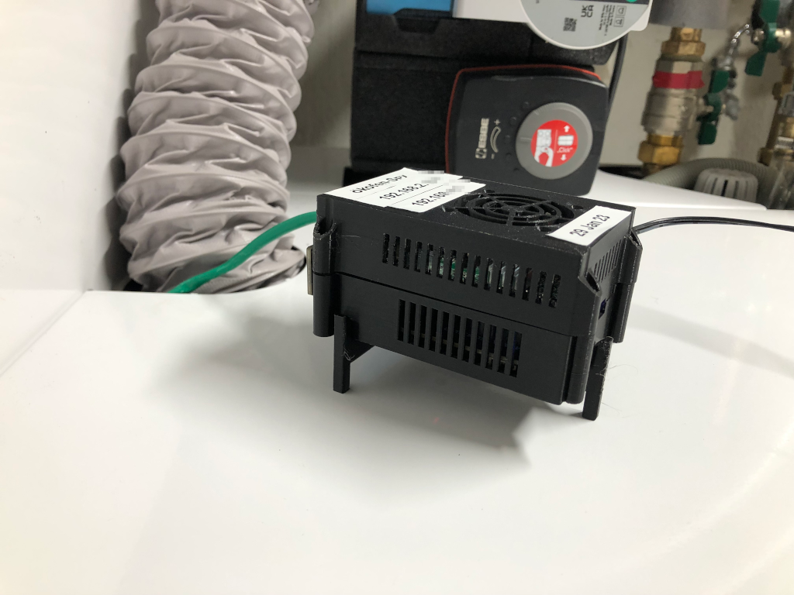
- sketch of the used network topology:
  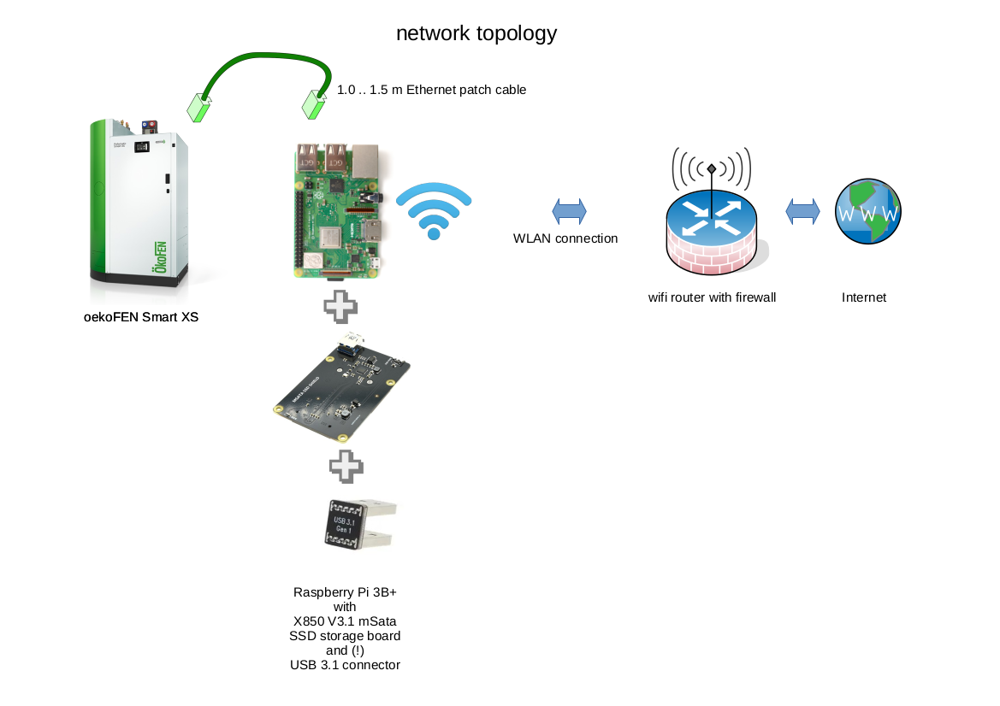
- used Grafana dashboard:
  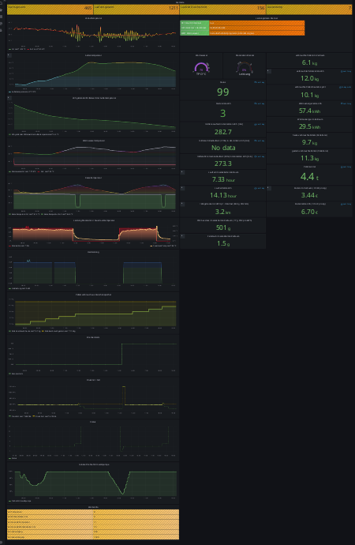
- adjustable Grafana variables:
  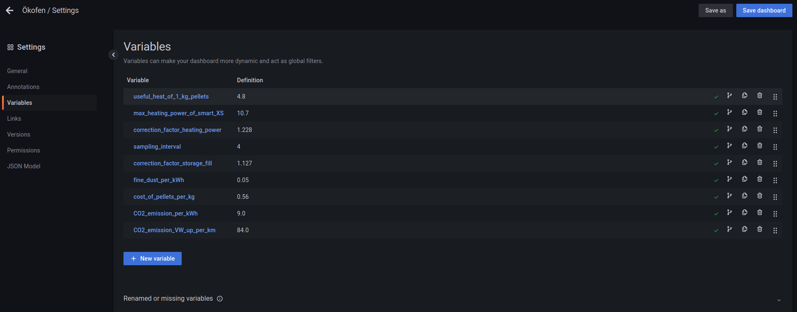
  
## Objectives of a [oekofen_spy](https://nc-x.com/oekofen-spy), InfluxDB, and Grafana proxy server
- analysis of a Oekofen Smart XS pellets heating by visualizing graphically the data of the Smart XS' Pelletronic Touch JSON interface
- set-up a Raspberrry Pi 3B+ based proxy server with wifi connection to your LAN's router
	+ that is running the [oekofen_spy](https://nc-x.com/oekofen-spy) application
	+ that is running an [InfluxDB](https://www.influxdata.com/) data base server
	+ that is running a [Grafana](https://grafana.com/) server for visualizing captured data
	+ the **oekofen_spy software** can be downloaded from [GitLab](https://gitlab.com/p3605/oekofen-spy)
	+ in my case I do not have a wired Ethernet LAN cabling to my cellar
	+ wired connection to a Oekofen Smart XS pellets heating by a Ethernet patch cable
	+ Wifi connection to your LAN's router
	+ bridge functionality between the Raspberry Pi's eth0 and wlan0 interfaces
	+ support a firewall to isolate and protect the Oekofen Smart XS pellets heating
	+ the proxy server can be put into a DMZ if your router is supporting a DMZ with a Wifi access point
	+ support a SSD drive with sufficient storage capacity in order to store measurement data of a longer time frame
	+ independent stand-alone operation and data collection of the [oekofen_spy](https://nc-x.com/oekofen-spy) proxy server even if the WLAN is switched off, e.g. during night time
	+ automatic unattended updates of the Raspberry Pi OS
	+ ssh maintenance connection to a dedicated client of your LAN, e.g your laptop	
## Required Hardware
- please carefully follow below **recipes** for a reduced RF disturbance of the Raspberry Pi's embedded WiFi
	+ in my case, my WiFi router is located in the attic floor, the Oekofen heating is in the cellar, three reinforced-concrete floors are in between, therefore the WiFi connection is very poor and each dB transmission gain is important
	+ if your router's antenna is turnable, please adjust it for best wifi transmission to such an angle that a plane perpendicular to the antenna stick is going through the oekofen_spy Raspberry Pi's location in the cellar
	+ if you are still experiencing too low Wifi signal levels in your cellar, you may experiment with a [directional YAGI WLAN Antenna EXTENSION for 2.4 GHz](https://www.thingiverse.com/thing:19548) or a [directional panel antenna](https://www.amazon.de/-/en/Network-APA-M25-directional-connector-WL-ANT-157/dp/B00R1PA9EO) (please note that this panel antenna is radiating only into one direction)
	+ **note:** any directional antenna results in worse RF radiation characteristics in non-preferred directions
	+ despite following these recipes, I am experiencing temporary RF disturbances and connection problems to the oekofen_spy Raspberry Pi in the cellar in the following situations
		+ my neighbor is using a baby phone which is heavily disturbing the wifi transmission
		+ the Oekofen Smart XS is igniting, obviously the fan of the Smart XS heating does a lot of RF disturbances
		+ the Oekofen Smart XS is filling the pellets buffer store. A cleaning with a running fan is part of that process
		+ in case of such RF disturbances, please just wait until the source of the disturbances is switched off. Then a connection should be possible again without any further action.
- Raspberry Pi 3B+. 
	+ if you can buy or [prepare](https://geeks-r-us.de/2019/02/03/raspberry-pi-3b-mit-externer-wlan-antenne/) a Raspberry Pi 3B+ board with an U.FL external antenna connector, go for it and enjoy a better WiFi transmission
- [Geekworm X850 V3.1 USB 3.0 mSATA SSD Storage Expansion Board for Raspberry Pi 3B+/3B](https://geekworm.com/products/raspberry-pi-3-x850-v3-0-usb-3-0-msata-ssd-storage-expansion-board), available e.g at Amazon
	+ please ensure that you purchase the 3.1 version
	+ please do not use older versions with higher RF emissions and disturbances
	+ wiki is [here](https://wiki.geekworm.com/X850)
	+ [installation guide](https://wiki.geekworm.com/Installation_Guide_For_X850_V3.0_New_Version) V3.0 version
- mSATA SSD 64 GB 3D NAND MLC SATA III mSATA (30 x 50,9 mm) [e.g. from here](https://www.amazon.de/Integrierte-Solid-State-Festplatte-Hochleistungs-Festplatte-Desktop-Laptop-Einschlie%C3%9Flich/dp/B07NJHX5JL)
- [Raspberry Pi USB 2.0 /USB 3.0 Connector Bridge / USB 3.0 Cable for Raspberry Pi 4B / 3B+(Plus)&X180/150 Board](https://de.aliexpress.com/item/4000807147152.html)
	+ please do not the connector bridge shipped together with the X850 board since it is not shielded and is causing RF disturbances
	+ please ensure a USB3.1 version with less disturbance of the Raspberry Pi's WiFi
- if you are experiencing stability problems, then connect [decoupling capacitors](./untar_dir/oekofen-spy/my_oekofen_spy_extension/decoupling_capacitors.png) to the GND and +5.0V GPIO pins of the Raspberry Pi 3B+ 
	+ 2x 470 uF electrolytic capacitor, 10V, take care of the polarity!
	+ 1x 0.15 uF ceramic capacitor
-  M2.5 12 mm nylon hexagonal spacers, nuts, and screws, e.g. from [here](https://www.amazon.de/Male-Female-Motherboard-Sortiment-Montieren-Kunststoffbox/dp/B07NK3S7C1?language=en_GB)
	+ please do not use the metal spacers shipped with the X850 board; they would disturb the Raspberry Pi's WiFi
	+ please use nylon spacers for not disturbing the Raspberry Pi's embedded WiFi
- a plastic case
	+ please do not use a metal case; it would worsen the Raspberry Pi's WiFi transmission
	+ I've [3D printed](./oekoFEN_Spy_Raspi_3B+_X850_mSata_SSD_case.png) this [PI case (room available for X850 Msata and Pi hat)](https://www.thingiverse.com/thing:3530981/remixes) 
		* however, it did not fit perfectly to the X850 V3.1 board, some tweaking of the case and x850 board was necessary
		* I've been to lazy to construct a fitting case
		* please be encouraged to share your fitting case
- System-S USB Type C Input to 2X Micro USB Output Y Cable Splitter Adapter Cable from e.g. [here](https://www.amazon.de/-/en/System-S-Input-Output-Splitter-Adapter/dp/B07FPBZTQN)
- original Raspberry Pi 4 power supply (yes Raspberry Pi 4 is correct) from e.g. [here](https://www.amazon.de/-/en/Raspberry-Pi-official-power-supply/dp/B07TMPC9FG/)
	+ it can supply a higher 3A current than a standard Raspi3 power supply (2.5A) for additionally supplying the SSD
	+ use in conjunction with above Y splitter cable
- a CAT6 1.5 m Ethernet patch cable, connect the LAN cable as follows:
  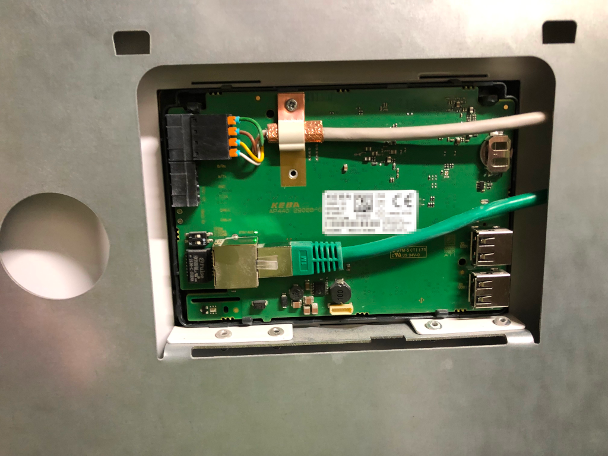
  
## Software
### Advisory
- since I don't want to break my production system and I do not have a separate test system, I unfortunately can not test the below software installation guidelines
- I had to do a lot of trial and error experiments to get my system up and running
- I am writing below instructions from my memory and may miss some parts in my description
- in case you are experiencing trouble with my instructions, please raise an issue at Github [here](https://github.com/FUEL4EP/oekoFEN_Spy_for_oekoFEN_Smart_XS_pellets_heating/issues) and ask for help

### Configure your OekoFEN Smart XS heating
- please execute these steps **at the Touch-display** of your heating's Pelletronic
- the firmware version of my Pelletronic is **Touch V4.00b**
- firstly connect your OekoFEN Smart XS heating Pelletronic temporarily to your LAN network without the **WiFi proxy server for Oekofen_Spy** in between
	- use a looooong Ethernet cable between your OekoFEN Smart XS heating Pelletronic and your router or next LAN network socket
	- alternatively as I did, you may use a Universal WiFi Internet
Adapter (e.g. Netgear WNCE2001)
	- in the Pelletronic menu 'General' touch to 'IP Config'
	- set 'JSON Modus' to **on** (compatible)
	- set remote maintenance to **on**
	- set the JSON port, default is '**4321**', and note it
	- set a JSON password and note it
	- switch DHCP to **on**
	- set a Web password and note it
	- check whether the automatically starting Pellectronic's network configuration is indicating a successful connection to LAN & Internet
	- check and note the IP address **\<ip-address of Pelletronic\>** of your Pelletronic that has been assigned by your router's DHCP server
	- only continue if your Pelletronic has established a successful connection to both LAN and Internet
	- if not, please check your router and firewall for correct settings
	- enter the URL
	 http://\<ip-address of Pelletronic\>:\<JSON port\>/\<JSON password\>/all
    - you should a JSON file output similar to [this one](./JSON_example.log)
    - if you are getting such a JSON file as output your configuration of your 
OekoFEN Smart XS heating Pelletronic is finished for now
	- you can now install  the [myPelletronic app](https://www.oekofen.com/de-de/mypelletronic-app/) on your mobile phone and remotely control your OekoFEN Smart XS heating 
	- For entering the Codelevel of your Pelletronic, you need a time variant 4 digit pass code. Please ask your heating contractor for help if you need it. A bit of googling e.g. for 'Das Kennwort für die Kundendienstebene setzt sich zusammen aus ' may also help you. Handle it with care!
	
### Install Raspberry Pi OS (64-bit)
- download the latest version of Raspberry Pi OS (64Bit) from [here](https://www.raspberrypi.com/software/operating-systems/#raspberry-pi-os-64-bit)
	+ choose 'Raspberry Pi OS with desktop 64-Bit'
- when writing this README.md, the latest version was [version 2023-05-03-raspios-bullseye-armhf-full.img.xz](https://downloads.raspberrypi.org/raspios_full_armhf/images/raspios_full_armhf-2023-05-03/2023-05-03-raspios-bullseye-armhf-full.img.xz)
- unpack and install this OS on an appropriate SD card and boot the Raspberry Pi 3B+
- for flashing the SD card [balenaEtcher](https://www.balena.io/etcher#download-etcher) is recommended
- for Linux OS, unpack with xz -d -v \<filename\>
- a getting-started documentation is available [here](https://www.raspberrypi.com/documentation/computers/getting-started.html):
	+ set location, language, keyboard, and time zone
	- as user name, please enter 'smartxslogin'
	- choose a safe password with at least 8 characters, write it down
	- set-up your Wifi connection
	- update the Raspberry Pi OS software
	- restart
		
### Check login and your WiFi connection
- login again after the restart
- check that you can access the internet via your WiFi connection

### Prepare the Raspberry Pi 3B+ for an USB drive
- please follow these [instructions](https://www.instructables.com/Booting-Raspberry-Pi-3-B-With-a-USB-Drive/)
- **note:** The Raspberry Pi 3 B+ can be USB booted out-of-the-box.

### Harden your Raspberry Pi
- apply appropriately [this hardening guide](https://chrisapproved.com/blog/raspberry-pi-hardening.html)
	+ do not disable the Raspberry Pi's WiFi since it is needed for this application
	
### Disable auto-login
- please follow these [instructions](https://www.raspberrypi-spy.co.uk/2022/02/disable-auto-login-in-raspberry-pi-os/)
- reboot and check a login
- shutdown

### Copy SD card to your mSata SSD
- plug your maSata SSD card  into the X850 board
- use [balenaEtcher](https://www.balena.io/etcher#download-etcher) for cloning the SD card#s content to the SSD mSata card
- connect the X850 board with your Raspberry Pi 3B+, ensure that your power supply is strong enough, see above hardware guidelines
- power-up the Raspberry Pi 3B+
- login in

### Reduce write cycles and extend SSD life expectancy
- some guidelines for reducing the write cycles to tthe mSata SSD canb be found [here](https://community.home-assistant.io/t/steps-to-reduce-write-cycles-and-extend-sd-ssd-life-expectancy/291718) or [here](https://www.laub-home.de/wiki/Raspberry_Pi_Schreiboperationen_minimieren) (in German language)
- add at the end of '/etc/fstab' the following line
> tmpfs /tmp tmpfs defaults,noatime,nosuid,nodev,noexec,mode=1777,size=128M 0 0
- this is mounting /tmp as a ramdrive tmpfs
- disable swapping by entering the following commands in a terminal window
> sudo systemctl disable dphys-swapfile  
sudo systemctl stop dphys-swapfile
- reboot and login again

### Install git and clone the repository from Github
-	execute the following commands in a LXterminal window:  
>  	cd ${HOME}   
  	sudo apt install git  
  	git clone https://github.com/FUEL4EP/oekoFEN_Spy_for_oekoFEN_Smart_XS_pellets_heating.git
- This command sequence will download the repository 'FUEL4EP/oekoFEN\_Spy\_for\_oekoFEN\_Smart\_XS\_pellets\_heating' from Github into the directory '${HOME}/oekoFEN\_Spy\_for\_oekoFEN\_Smart\_XS\_pellets\_heating'
- These commands are also stored in the script 'git_clone.bsh'. Please note that this script needs to be executed as normal user!

### Customize the installation to your network and system
- please open in a text editor the bash script '${HOME}/oekoFEN\_Spy\_for\_oekoFEN\_Smart\_XS\_pellets\_heating/customize_installation.bsh'
- at the top you will find a customization section:
  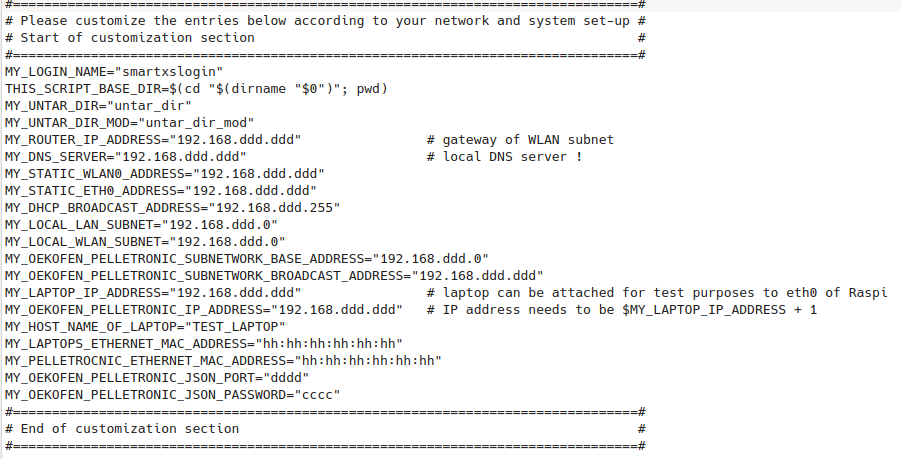
 	* d:= digit
 	* h:= hexadecimal character	
- please change the entries after the equal sign to fit to your network and system set-up
- An example of a customization is here:
 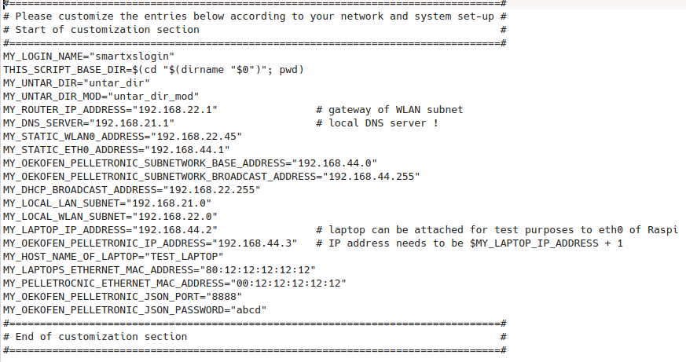
- now run the customization script as sudo:
> sudo ./customize_installation.bsh
- the script is patching the subdirectory '${HOME}/oekoFEN\_Spy\_for\_oekoFEN\_Smart\_XS\_pellets\_heating/${MY\_UNTAR\_DIR\_MOD}'
- please check the patched set-up files in this directory

### Do a first set of software installations and configuration
- ensure that the customization sections in '\${HOME}/oekoFEN\_Spy\_for\_oekoFEN\_Smart\_XS\_pellets\_heating/install_software_packages\_1.bsh' and '${HOME}/oekoFEN\_Spy\_for\_oekoFEN\_Smart\_XS\_pellets\_heating/customize\_installation.bsh' are consistent
- then execute this script as normal user
> bash ${HOME}/oekoFEN\_Spy\_for\_oekoFEN\_Smart\_XS\_pellets\_heating/install\_software_packages_1.bsh

### Patch the installation
- ensure that the customization sections in '${HOME}/oekoFEN\_Spy\_for\_oekoFEN\_Smart\_XS\_pellets\_heating/patch\_installation.bsh' and '${HOME}/oekoFEN\_Spy\_for\_oekoFEN\_Smart\_XS\_pellets\_heating/customize\_installation.bsh' are consistent
- then execute the script that will patch the root directory '/':

  sudo ${HOME}/oekoFEN\_Spy\_for\_oekoFEN\_Smart\_XS\_pellets\_heating/patch_installation.bsh
 

### Reboot
- reboot as normal user without sudo:

> reboot

- after the reboot you can check part of the new configuration e.g. by the commands

> ifconfig    
hostname
- please note that sudo is now requiring to enter a password

### Configure the software
- for configuration, please execute now the script

>  sudo ${HOME}/oekoFEN\_Spy\_for\_oekoFEN\_Smart\_XS\_pellets\_heating/configure_1.bsh

- this script will reboot the Raspberry Pi 3B+ at the end
- login again after reboot as normal user

### Final installation of influxdb and grafana
- execute the script

> sudo ${HOME}/oekoFEN\_Spy\_for\_oekoFEN\_Smart\_XS\_pellets\_heating/install\_software_packages_2.bsh
  
- this script will execute a reboot at the end

### Final checks of the installation
- the execution of
> sudo systemctl --type service --state running  
  
- should show these running services:
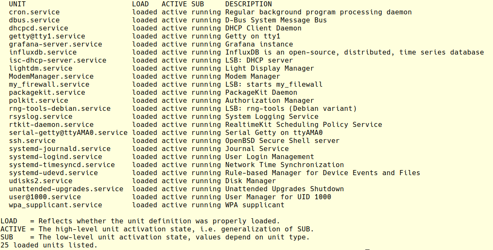
- the execution of
> sudo systemctl status isc-dhcp-server.service  
 
- should show an output like this:  
  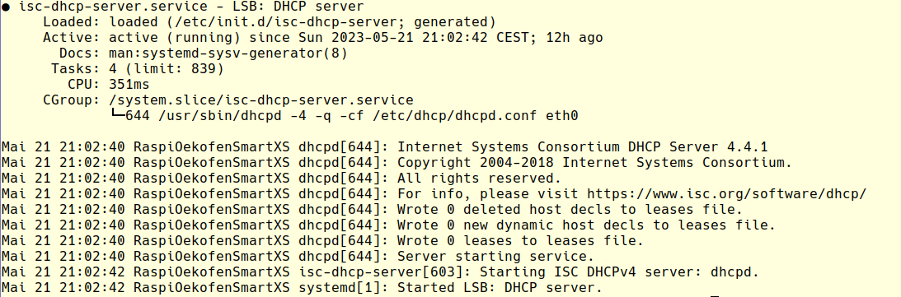

### First login into the Grafana fana server
- use a PC or laptop connected to your WiFi network
  - enter into a browser, e.g. firefox, as URL
> http://\<MY\_STATIC\_WLAN0\_ADDRESS\>:3000
- Note: This is **NOT** a https, but a **http** URL!
- MY\_STATIC\_WLAN0\_ADDRESS is the WLAN IP address of the Raspberry Pi specified in the script [customize_installation.bsh](./customize_installation.bsh)
- you should get now such a login window
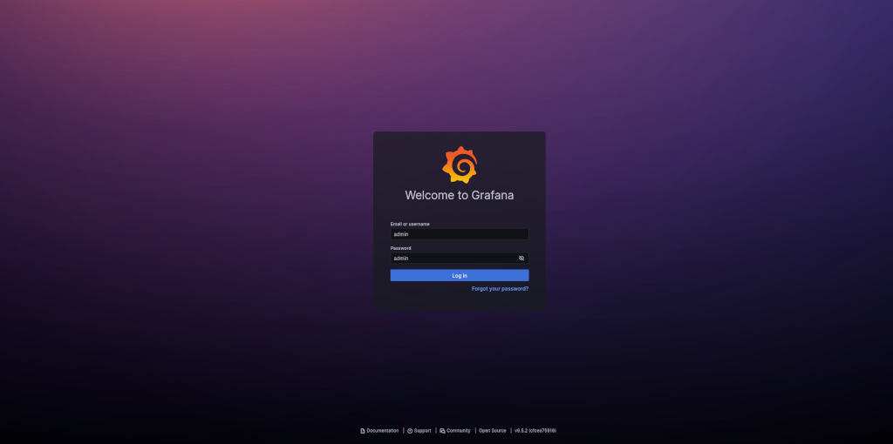
- use as initial username and password

>  username: admin  
password admin

- after a successful login please immediately change the password of the admin account
	+ Move the mouse cursor on 'Toggle Menu' at the top left
	+ click 'Administration# sub menu
	+ click 'Users'
	+ click to 'admin'
	  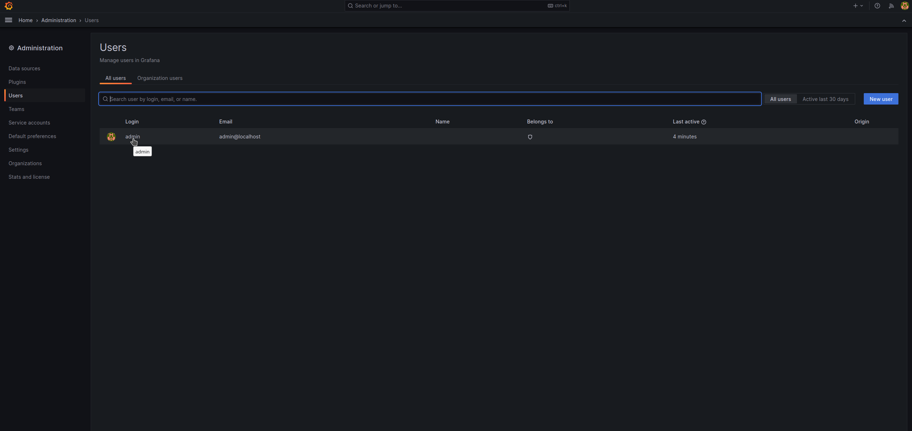
	+ edit 'password' and change it to a new secure password (> 8 characters)
	+ note the new admin password

### Create new users of Grafana as needed
- create new users with limited permissions as needed
- please follow the standard Grafana documentation for that purpose
- always use a non-admin user for viewing Grafana desktops

### Configure Grafana
- please follow the [recipe]((https://gitlab.com/p3605/oekofen-spy)) of [Peter Fuerle](https://nc-x.com/about) in section 'configure Grafana'
- here as reference a screen dump of the setup of the data source:
  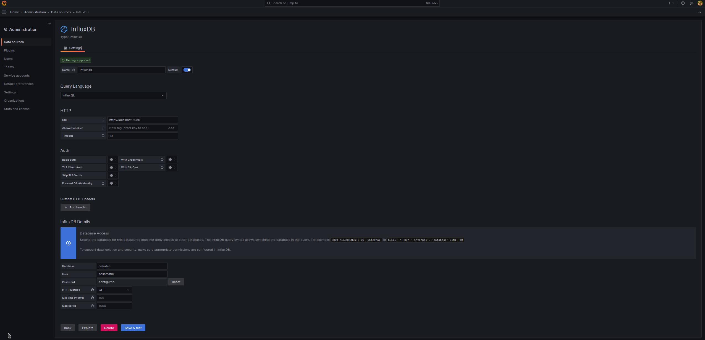
- no other configurations are necessary except  those in section 'configure Grafana' 
- if you have questions, please raise an issue at my Github repository

## Import the customized dashoard JSON for Oekofen Smart XS pellets heating
-	move the mouse cursor on 'Toggle Menu' at the top left
-	click 'Dashboards' sub menu
	+ click 'new' => 'import'
	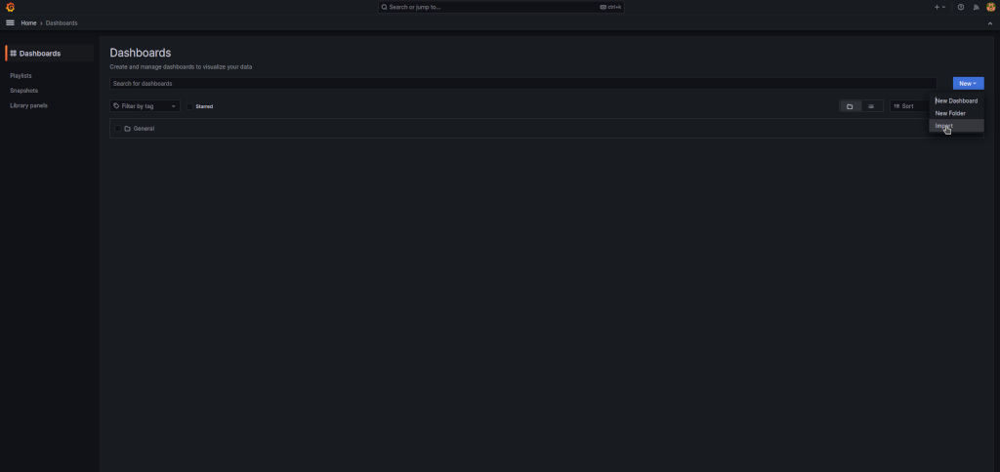
	+ click 'upload JSON dashboard file' and browse to
	>    ${HOME}/oekoFEN\_Spy\_for\_oekoFEN\_Smart\_XS\_pellets\_heating/untar\_dir\_mod/oekofen-spy/my\_oekofen\_spy\_extension/oekoFEN-Spy-Smart_XS.json

	* click 'import' 

- save the imported dashboard by clicking to 'save dashboard' at the top right
  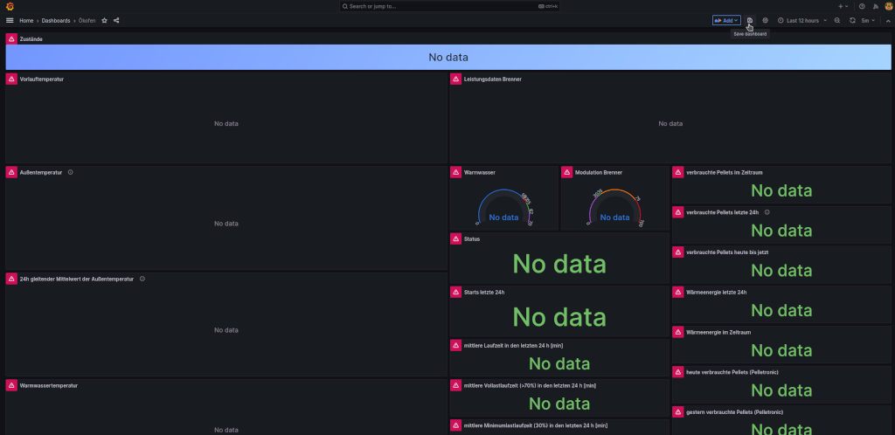
- this dashboard is now available in Grafana as dashboard 'General:Ökofen'
- the running cron process should now add every 4 minutes a set of new measurements to the InfluxDB which is then displayed in Grafana

> */4 *  * * * smartxslogin /usr/bin/python3 /home/smartxslogin/oekofen-spy/oekofen-spy-main/Python3/oekofen2influx.py
  
- refresh Grafana as necessary

### ssh access
- You may establish a ssh connection from your PC or laptop connected to the same WiFi network as follows
- ssh \<MY\_STATIC\_WLAN0_ADDRESS\> -l \<MY\_LOGIN\_NAME\>
- the password is the specified login password of your <MY_LOGIN_NAME> account
- you may need to configure your router's, PC's or laptop's firewalls appropriately for allowing ssh accesses

## Good luck and fave fun with your OekoFen SPY
- connect the Raspberry Pi 3B+ according to the above picture of the network toplogy
- wait a minute ..
- connect with your PC or laptop to the Grafana server using the browser URL

> http://\<MY\_STATIC\_WLAN0_ADDRESS\>:3000
  
- good luck and have fun with the Oekofen SPY

## Hint: How to find out the MAC address of your OekoFEN Smart XS heating
- for above configuration you need the Ethernet MAC address of your Pelletronic \<MY\_PELLETROCNIC\_ETHERNET\_MAC\_ADDRESS\>
- one possibility to identify the MAC address is establishing a direct LAN connection, see above, to your LAN router and check the MAC address in your router
- another possibility is to plug in a LAN cable attached to your Pelletronic (see above) into the Raspberry Pi's eth0 LAN socket and check the tail of '/etc/var/syslog' for such a message
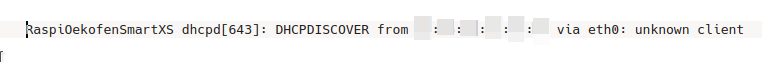
	- the MAC number is pixelized, enter this MAC address with the colons as \<MY\_PELLETROCNIC\_ETHERNET\_MAC\_ADDRESS\> into the script '${HOME}/oekoFEN\_Spy\_for\_oekoFEN\_Smart\_XS\_pellets\_heating/customize_installation.bsh'

### Test mode with a laptop attached to the Raspi's eth0 port
- for test purposes you can attach your laptop with an Ethernet patch cable to the Raspberry Pi3+ based WiFi proxy server for Oekofen_Spy. For that purpose edit a sudo the file '/opt/my_firewall/simple_firewall.bsh' as follows:
	- comment out line 9: 
	- comment line 12
	- save
	- execute 'sudo /etc/init.d/my_firewall restart'
- plug in your laptop and check if you get assigned an IP address
- note that the firewall is limiting the outgoing connections to those defined in the control file '/opt/my_firewall/allowed_urls.txt'
- **do not forget to reverse the above commenting back after your tests!**

### Reduced Tx power during nighttime
- since I am switching off my WiFi during night, the Raspberry Pi's Tx WLAN power is reduced during night by a cron process:

>  30 23 * * * root /home/smartxslogin/scripts/wlan_9dbm.bsh  
9 07 * * * root /home/smartxslogin/scripts/wlan_31dbm.bsh
- you may change this according to your needs

### Calibration of the Grafana dashboard variables

- the shipped Grafana dashboard variables
  
- were calibrated to my system and may not fit to your system
- therefore, you may calibrate them if you have a heat meter in your system
- please compare the heat energy calculated by Grafana with the heat energy measured by your heat meter
- please consider the heat energy for hot water appropriately since it is usually not captured by a heat meter
- the update of the Grafana variable is done as follows:
	+ you need to login as 'admin'
	+ click to 'Dashboard settings' at the top right
	  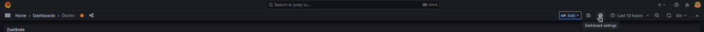
	+ click to 'Variables'
	  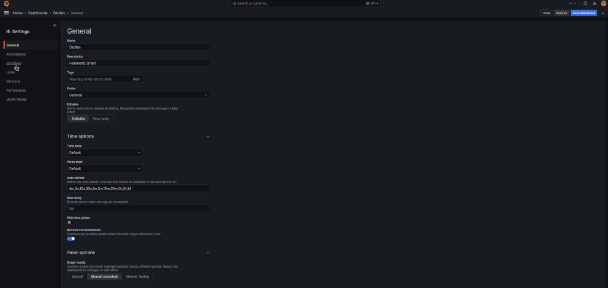
	+ click on the variable to be changed
	  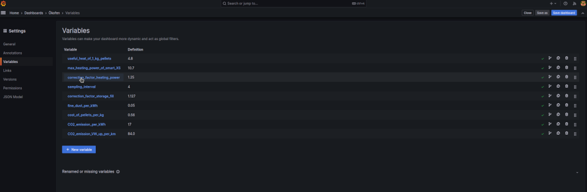
	+ Change the parameter in the 'Custom options' field
	  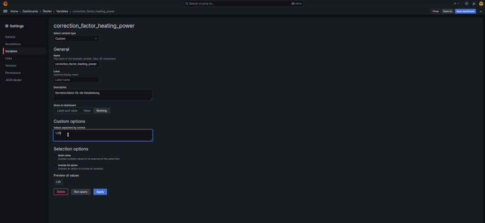
	+ Click 'Save dashboard' at the top right
	  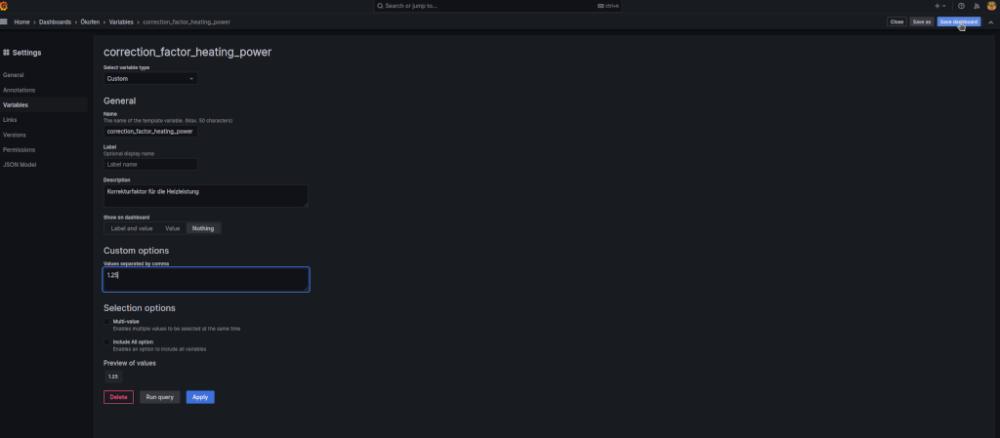
	+ Click 'Save'
	  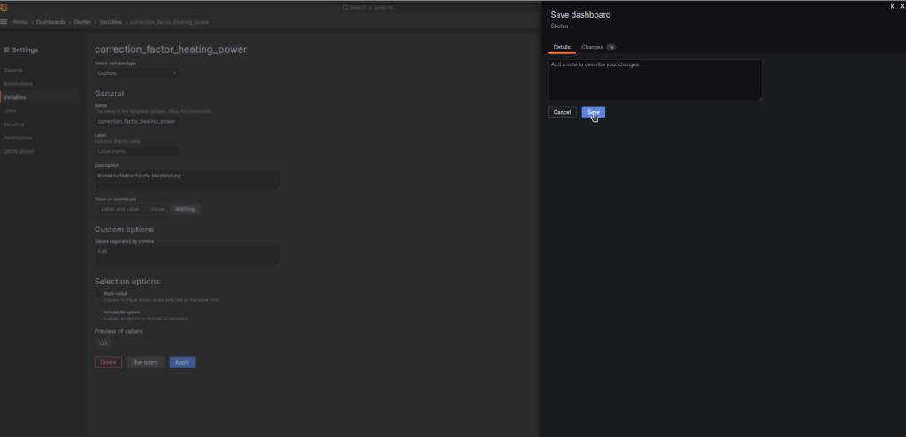
	+ Done, repeat as needed, several days observation and comparison is needed

## Add a retention policies to the InfluxDB data base 'oekofen'
- in order to limit the size of the InfluxDB data base 'oekofen', you may add a retention policy as follows
- a how to reference can be found [here](https://kb.groundworkopensource.com/display/DOC721/How+to+change+performance+data+retention+policies+in+InfluxDB2009)

- execute the following commands for setting a retention period of 56 weeks:

> influx -execute 'show retention policies on "oekofen"'  
influx -execute 'create retention policy "oekofen_56_weeks" on "oekofen" duration 56w replication 1 default'  
influx -execute 'show retention policies on "oekofen"'
influx -execute 'alter retention policy "oekofen_56_weeks" on "oekofen" default'  
influx -execute 'show retention policies on "oekofen"'

- adapt the retention period to your needs

## Some recommendations for settings of the Oekofen Smart XS pellets heating
- the initial settings of my freshly installed Oekofen Smart XS pellets heating resulted in too many unnecessary ignitions
- for a minimum number of ignitions in winter mode, the following parameter settings turned out to be effective **for my system**:
	+ your system may require different settings!
	+ less ignitions will reduce the fine dust emissions
	+ Pellematic Setting: Switch Off Temp: 77 deg C
	+ Pellematic Setting: Control Temperature: 53 deg C
	+ Pellematic Setting: Switch On Hyst: 29 K
	+ Pellematic Setting: hysteresis shutdown: 8K
	+ Pellematic Setting: Capacitive Sensor RA Active: On
	+ Pellematic Setting: Capacitive Sensor ZW Active: On
	+ Heating Control: Room Temp Heating: 22.5 deg C
	+ Heating Control: Eco Mode: Ecological
	+ Heating Water Setting: Op. Mode: Auto
	+ Heating Water Setting: Time 1: 6:30 - 7:15 (adjust to your needs)
	+ Heating Water Setting: Time 1: Preference: Off
	+ Heating Water Setting: Legionella Protection: Off (adjust to your needs)
	+ Return Pump Settings: Mode: Auto
	+ Return Pump Settings: Time 1: 6:45 - 7:15 (adjust to your needs)
	+ Pellematic Setting: adjust your heat curve to a your buildings needs  
		+	try to achieve a minimum flow temperature at a cold day
		+	my setting is
			* Heating Curve: 0.7
			* Base Point: 32 deg C
			* H Limit Heating: 20 deg C
	+ I am not using night setback
	+ your average burn time in winter mode should be > 150 minutes
	+ at cold days, just one ignition may be necessary
- summer mode is still under investigation at my side
	+ a photovoltaics supplied heating rod is planned for summer mode
- these are just recommendations, see **Disclaimer** below

## Mistakes or incompleteness of this recipe
- please help to improve this repository by raising a Github issue if you find any deficiency. Thanks a lot in advance.
- as said, I could not validate all instructions of this recipe, but most 

## Disclaimer
- please let your system's settings be checked and confirmed by your heating contractor
- I am not responsible for any of **your** system's settings
- always ask your heating contractor if you need more information or advice on your system

## License 

**Creative Commons BY-NC-SA** 
Give Credit, NonCommercial, ShareAlike

 This work is licensed under a <a rel="license" href="http://creativecommons.org/licenses/by-nc-sa/4.0/">Creative Commons Attribution-NonCommercial-ShareAlike 4.0 International License</a>.

-EOF